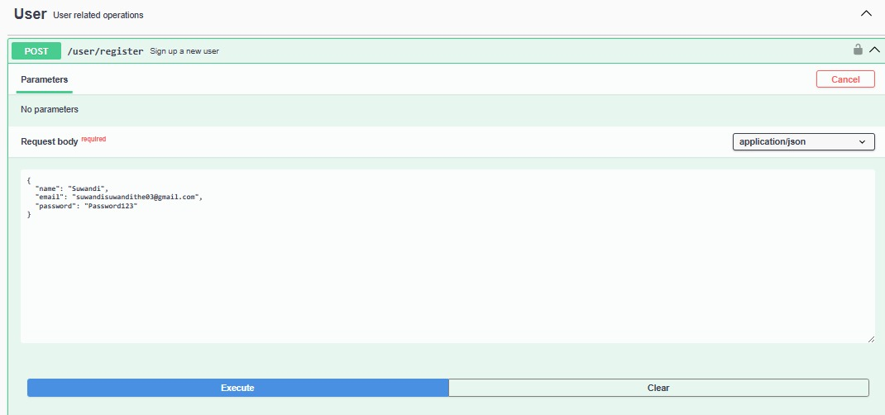

# WADS_Session8_Assignment - Creating REST API for Todo App frontend

## API Docummentation using swaggerjs

### Authentication

### Endpoints:

To register an account, user must fill in 3 fields which are name, email, and password. As we can see from the picture above, the backend return a message that says user is created, but not verified. Therefore, we will verify it using the verification code that the backend has generated as well.

To verify the registered email, user will first receive an email that contain a verification code after they register their account. As we can see from the picture above, once I entered the verification code, my registered email has been verified successfully. Then, I can login to the todo app.

To login to the todo app, user must provide their email and password that they input in the register form.

User can also logout from the todo app, and they cannot access the todo app if they are logget out.

As mentioned previously, if the user is logged out, they will not be able to access any services from the todo app. They need to login again to access it, so we will login again and perform the CRUD for the todo app.

As we can see, after we logged in, we can already access the todo app services. The picture above is the getTodo function that responsible to fetch all task for a specific user.

To add a task, user must provide at least the title of the task. They can leave the description as null if they do not want any description. As we can see from the picture above, the task is created for the account that we are logged in.

To update a todo, user will need to input the details that they want to update, and just simply save it.

User can also delete the their specific task if they do not want it on their list anymore.

